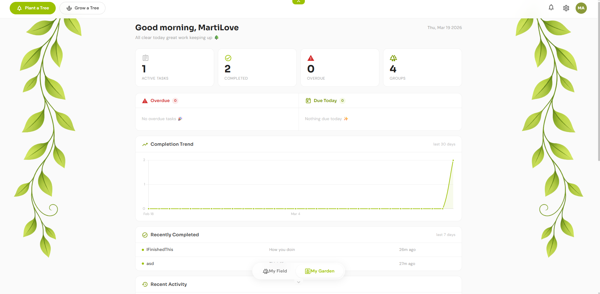

<p align="center">
  
</p>

<h1 align="center">Plantitask</h1>

<p align="center">
  <strong>Small Teams who Plant Trees</strong>
</p>

<p align="center">
  A nature-themed gamified task management platform where completing tasks grows virtual trees on your field, and a portion of revenue plants real ones.
</p>

<p align="center">
  
  
  
  
  
  
  
  
  
  
</p>

---

## What is Plantitask?

Plantitask is a full-stack SaaS application that reimagines project management for small teams. Instead of spreadsheets and complex enterprise tools, teams organize work through a visual field where each project is a tree. As tasks get completed, the tree grows from a seed to a flowering tree.

The platform is built on a real mission: a portion of all future revenue will go to tree-planting foundations like One Tree Planted and Trees for the Future.

---

## Screenshots

### Landing Page
<p align="center">
  
</p>

### The Field
> Each tree represents a project group. Plant seeds to create groups, drag trees to rearrange, and watch them grow as tasks are completed.
<p align="center">
  
</p>

### Kanban Board
> Drag-and-drop task management with optimistic concurrency. Move tasks between columns or reorder within a column. The backend handles simultaneous edits gracefully with automatic retry logic.
<p align="center">
  
</p>

### My Garden (Dashboard)
> Personal overview with active tasks, overdue alerts, completion trends, and group statistics.
<p align="center">
  
</p>

<details>
<summary><strong>More Screenshots</strong></summary>

### Task Creation
<p align="center">
  
</p>

### Real-time Notifications
<p align="center">
  
</p>

### Authentication
<p align="center">
  
  &nbsp;&nbsp;
  
</p>

</details>

---

## Tech Stack

### Backend

| Layer | Technology |
|-------|-----------|
| Framework | ASP.NET Core 8 Web API |
| Architecture | Clean Architecture (Core / Infrastructure / API) |
| ORM | Entity Framework Core 8 |
| Database | PostgreSQL 16 |
| Authentication | JWT Access Tokens + Refresh Token Rotation |
| Token Storage | Redis (JWT blacklist, refresh tokens, verification codes) |
| Real-time | SignalR (NotificationHub) |
| Background Jobs | Hangfire (overdue task checks, scheduled notifications) |
| Email Service | SendGrid (production) + SMTP (development fallback) |
| Concurrency | Optimistic Concurrency Control (RowVersion with retry logic) |
| Soft Delete | Global query filters with audit trail preservation |
| Data Seeding | Lookup tables (TaskStatus, TaskPriority, GroupRole) |
| Audit Trail | Denormalized user snapshots for historical accuracy |
| Testing | xUnit + Moq (unit and integration tests) |
| API Documentation | Swagger / OpenAPI |
| Rate Limiting | ASP.NET Core 8 Fixed Window (60 req/min general, 10 req/min auth) |

### Frontend

| Layer | Technology |
|-------|-----------|
| Framework | Blazor WebAssembly (.NET 9) |
| Component Library | MudBlazor v9 |
| Canvas Engine | PixiJS 8 (via JS Interop) |
| State Management | Cascading Parameters + Service Events |
| Local Storage | Blazored.LocalStorage |
| Styling | Custom CSS (Sora + DM Sans typography) |

---

## Architecture

The backend follows **Clean Architecture** with strict dependency rules. The domain layer has zero external dependencies. Infrastructure depends on Core. The API layer orchestrates everything.
```
src/
├── TaskManagement.Core/             # Entities, DTOs, Interfaces, Enums
│   ├── Entities/                    # Domain models (User, Group, TaskItem, etc.)
│   ├── DTO/                         # Data transfer objects per feature
│   ├── Interfaces/                  # Service contracts (IGroupService, ITaskService)
│   ├── Enums/                       # GroupRole, TreeStage, TaskStatus
│   ├── Common/                      # Result pattern, Error types
│   └── Constants/                   # TreeThresholds, business rules
│
├── TaskManagement.Infrastructure/   # EF Core, Service implementations
│   ├── Data/                        # DbContext, Configurations, Migrations
│   └── Services/                    # AuthService, GroupService, DashboardService
│
├── TaskManagement.Api/              # Controllers, Middleware, Program.cs
│   ├── Controllers/                 # REST endpoints per aggregate
│   ├── Middleware/                  # Exception handling, rate limiting
│   └── Hubs/                        # SignalR NotificationHub
│
└── TaskManagement.Web/              # Blazor WebAssembly frontend
    ├── Pages/                       # Razor pages (Landing, Login, Field)
    ├── Layout/                      # MainLayout, PublicLayout
    ├── Services/                    # API client services (inherit BaseApiService)
    ├── Models/                      # Frontend DTOs and view models
    └── wwwroot/                     # Static assets, PixiJS engine, CSS
```

### Key Design Patterns & SOLID Principles

**Clean Architecture** with strict dependency inversion. Core has zero external dependencies and defines all interfaces. Infrastructure implements them. The API layer only orchestrates. No project references flow inward.

**Result Pattern** replaces exception-based error handling across the entire backend. Services return `Result<T>` instead of throwing. Controllers convert results via a `ToActionResult()` extension method. The frontend mirrors this with `ServiceResult<T>` for consistent error display on every page, following the same two-line pattern: check success, use data or show error.

**Dependency Inversion Principle (SOLID "D")** applied everywhere. Every service has an interface (`IAuthService`, `IGroupService`, `ITaskService`, `IDashboardService`, `IFieldUIService`). Pages and controllers depend on abstractions, never concrete classes. This enables unit testing with Moq and makes swapping implementations trivial.

**BaseApiService Inheritance** (Open/Closed Principle). All frontend HTTP services inherit from a shared abstract base class providing `GetAsync<T>`, `PostAsync<T>`, `PutAsync<T>`, `DeleteAsync<T>`, and unified error parsing. Adding a new API service means writing only the public methods. The base class is closed for modification, open for extension.

**DelegatingHandler Pipeline** for cross-cutting authentication concerns. `AuthTokenHandler` sits in the HTTP pipeline and automatically attaches JWT tokens to outgoing requests, handles 401 responses with silent token refresh, and clones failed requests for retry. Individual services never touch authorization headers. This follows the Single Responsibility Principle by keeping auth logic out of business services.

**Refresh Token Rotation** with automatic revocation. Each token refresh invalidates the previous refresh token and issues a new pair. The `ReplacedByToken` chain allows detection of token reuse attacks. Tokens are hashed before storage using BCrypt.

**Optimistic Concurrency Control** for conflict resolution. Entities carry a `RowVersion` (timestamp/byte array) checked by EF Core on every update. When two users modify the same task simultaneously, the second write receives a `DbUpdateConcurrencyException` which surfaces as a conflict response. No database locks are held during user think-time.

**Retry-Based Conflict Resolution** for Kanban operations. When two users move tasks simultaneously, the second operation receives a `DbUpdateConcurrencyException`. Rather than merging conflicting changes (complex and error-prone), the service clears the EF Core change tracker and retries with fresh database state. This "last-write-wins-after-retry" approach guarantees sequential DisplayOrder values and mirrors industry patterns used by Jira, Trello, and GitHub Projects. Exponential backoff (50ms, 100ms, 150ms) prevents thundering herd issues.

**Observer Pattern (Event Bus)** for cross-component communication on the frontend. `FieldUIService` decouples the MainLayout navigation buttons from the Field page. The layout fires events, the page subscribes. No tight coupling, no query parameter hacks, no shared mutable state.

**Background Job Processing** via Hangfire with Redis storage. Recurring jobs detect overdue tasks and fire notifications. Scheduled jobs handle deferred email delivery and expired token cleanup. The Hangfire dashboard provides operational visibility.

**Soft Delete Pattern** across all major entities. Deleted records are marked inactive rather than removed, enabling account recovery within a 90-day window and maintaining audit trail integrity. Queries filter soft-deleted records automatically via global query filters.

**Audit Logging** on all state-changing operations. The `IAuditService` records who changed what, when, and in which group. Controllers call `LogAuditAsync` after successful mutations. The audit trail is queryable per group, per task, or per user.

**Custom Authentication State Provider** bridges JWT tokens with Blazor's built-in authorization framework. It reads the JWT from localStorage, parses claims without signature validation (that is the backend's job), checks expiration, and exposes the user identity to `AuthorizeView` and `[Authorize]` attributes throughout the component tree.

**Factory Pattern** for database context creation. `ApplicationDbContextFactory` provides design-time context instantiation for EF Core migrations, completely separate from the runtime DI pipeline.

**Seeded Random Generation** for deterministic PixiJS field layouts. Decorations are randomly placed using a hash of the user ID as the seed, so the field looks identical across sessions and devices without storing positions.

---

## Features

### Implemented

- JWT authentication with refresh token rotation and silent renewal
- Redis-backed token blacklist and verification code cache
- Email verification flow with 6-digit codes
- Google OAuth placeholder (ready for integration)
- Group creation with auto-generated join codes and optional passwords
- Role-based access control (Owner, Manager, Team Lead, Member)
- Interactive PixiJS canvas field where trees represent groups
- Drag-and-drop tree repositioning with localStorage persistence
- Seed planting flow: drag from inventory, click field, create group
- Tree growth stages tied to task completion percentage (7 stages from EmptySoil to FloweringTree)
- Real-time updates via SignalR for live tree growth
- **Kanban board backend** with:
  - Drag-and-drop task reordering (same column & cross-column)
  - Optimistic concurrency with automatic retry (up to 3 attempts)
  - DisplayOrder management with gap-free sequential numbering
  - Real-time updates via SignalR on task moves
  - Automatic CompletedAt timestamp when tasks reach "Done"
- File attachments with local and Azure Blob storage support
- Task comments and activity feed
- Hangfire background jobs for overdue task detection and scheduled notifications
- SendGrid email integration for verification, password reset, and task alerts
- Responsive design with hideable top and bottom navigation
- Notification system with slide-in panel and background delivery
- Dashboard statistics (tasks by status, completion trends, member workload)
- Rate limiting (60 req/min general, 10 req/min auth)
- Audit logging for compliance tracking
- Comprehensive test suite (xUnit + Moq)

### In Progress

- Blazor WebAssembly frontend (Phase 10 - active development)
  - Field page (complete)
  - Kanban board UI
  - Dashboard
  - User settings

### Planned

- Sprint planning
- Task dependencies
- Advanced filtering and search
- Cosmetic store (custom trees, seasonal items, team themes)
- Stripe payment integration
- Real tree counter on landing page
- Dark mode

---

## Authentication Flow

The login experience adapts based on whether the user already has an account:

1. User enters their email address
2. The system checks if the email exists
3. **Existing user** is prompted for their password and sent directly to The Field
4. **New user** receives a 6-digit verification code via SendGrid, completes email verification, sets up their account (username, password), and is then sent to The Field

Verification codes are cached in Redis with a short TTL. JWT access tokens expire after 15 minutes and are silently refreshed via a `DelegatingHandler` in the HTTP pipeline. Refresh tokens use rotation with automatic revocation of the previous token on each renewal.

---

## The Tree Growth System

Trees on the field visually represent project health. Growth is calculated from the percentage of completed tasks within a group:

| Completion | Stage | Visual |
|-----------|-------|--------|
| 0% | Empty Soil | Seed sprite |
| 1-19% | Seed | Small sprout |
| 20-39% | Sprout | Sprouting plant |
| 40-59% | Sapling | Small bush |
| 60-79% | Young Tree | Medium tree |
| 80-99% | Full Tree | Large tree |
| 100% | Flowering Tree | Full tree with flowers |

All tree sprites are original pixel art assets rendered on an HTML5 canvas via PixiJS 8.

---

## API Overview

The backend exposes a RESTful API organized by aggregate:

| Endpoint Group | Description |
|---------------|-------------|
| `POST /api/auth/*` | Registration, login, token refresh, email verification, password reset |
| `GET/POST /api/groups` | Create groups, join via code, list user groups, manage members and roles |
| `GET/POST /api/tasks/*` | CRUD operations, Kanban ordering, assignments, status transitions |
| `GET /api/kanban/*` | Get Kanban board, move tasks with drag-and-drop |
| `GET /api/dashboard/*` | Personal dashboard, field tree data, group statistics |
| `GET /api/notifications` | User notifications with read/unread state |

All endpoints use the Result pattern: success returns the raw data with a 200 status, failure returns `{ status: int, message: string }`.

---

## Testing Strategy

The backend includes comprehensive test coverage using **xUnit** and **Moq**:

**Unit Tests:**
- Service layer business logic (auth, tasks, groups, dashboard)
- DTO validation
- Helper method correctness

**Integration Tests:**
- End-to-end API flows
- Database operations with in-memory provider
- Concurrency conflict scenarios
- SignalR hub message delivery

**Tested Scenarios:**
- Concurrent task moves with optimistic concurrency
- Refresh token rotation and revocation chains
- Email verification code expiration
- Soft delete filtering
- Audit log generation
- Tree growth calculation edge cases

**Test Philosophy:**
Tests cover critical paths and edge cases, not 100% coverage for the sake of it. Focus on business logic correctness and concurrency safety.

---

## Performance Considerations

**Query Optimization:**
- Database projection with `.Select()` to minimize data transfer
- Composite indexes on `(GroupId, StatusId, DisplayOrder)` for Kanban queries
- `.AsNoTracking()` for read-only operations to reduce change tracker overhead

**Caching Strategy:**
- Redis for JWT blacklist and verification codes
- SignalR backplane for multi-instance deployments
- Frontend localStorage for field tree positions

**Concurrency:**
- Optimistic concurrency prevents database locks during user think-time
- Automatic retry with exponential backoff (50ms, 100ms, 150ms)
- No pessimistic locks - high throughput under load

**Scalability:**
- Stateless API design enables horizontal scaling
- SignalR with Redis backplane for multi-server sticky sessions
- Hangfire job distribution across workers

---

## Deployment

**Current:** Local development environment

**Planned:** Azure full-stack deployment
```
Target Architecture:
- Azure App Service (API)
- Azure Database for PostgreSQL
- Azure Cache for Redis
- Azure Blob Storage (file attachments)
- Azure SignalR Service (for horizontal scaling)
- GitHub Actions CI/CD pipeline
```

---

## Getting Started

### Prerequisites

- [.NET 8 SDK](https://dotnet.microsoft.com/download/dotnet/8.0) (backend)
- [.NET 9 SDK](https://dotnet.microsoft.com/download/dotnet/9.0) (frontend)
- [PostgreSQL 16](https://www.postgresql.org/download/)
- [Redis](https://redis.io/download/) (token cache, verification codes)

### Setup

1. **Clone the repository**
```bash
git clone https://github.com/IgnjatRadojicic/TaskManagement.git
cd TaskManagement
```

2. **Configure the backend**

Copy `appsettings.Development.json.example` to `appsettings.Development.json` in the API project and update:
```json
{
  "ConnectionStrings": {
    "DefaultConnection": "Host=localhost;Database=plantitask;Username=postgres;Password=yourpassword"
  },
  "JwtSettings": {
    "Secret": "your-256-bit-secret-key-here-make-it-long",
    "Issuer": "Plantitask",
    "Audience": "Plantitask",
    "AccessTokenExpirationMinutes": 15,
    "RefreshTokenExpirationDays": 7
  },
  "App": {
    "FrontendUrl": "https://localhost:7110"
  }
}
```

3. **Apply database migrations**
```bash
cd src/TaskManagement.Api
dotnet ef database update --project ../TaskManagement.Infrastructure
```

4. **Run the backend**
```bash
cd src/TaskManagement.Api
dotnet run
```

The API will be available at `http://localhost:5212` with Swagger at `/swagger`.

5. **Run the frontend**
```bash
cd src/TaskManagement.Web
dotnet run
```

The app will be available at `https://localhost:7110`.

---

## What I Learned Building This

This project was a comprehensive journey through production-grade .NET development and full-stack architecture:

**Backend Architecture:**
- Implemented Clean Architecture with strict dependency rules, learning how to structure enterprise applications for maintainability and testability
- Discovered the trade-offs between Repository pattern and direct DbContext access - chose pragmatism over dogma
- Built optimistic concurrency from scratch using RowVersion, understanding when to use transactions vs. when optimistic locking is sufficient
- Learned that architectural decisions should be driven by actual needs, not theoretical purity

**Concurrency & Race Conditions:**
- Discovered subtle EF Core bugs like change tracker accumulation during retry loops (fixed with `ChangeTracker.Clear()`)
- Implemented "retry-with-fresh-data" instead of Microsoft's merge strategy after analyzing the complexity trade-offs
- Understood why certain operations (like Kanban ordering) behave like bank transfers rather than document editing - sequential data can't be safely merged
- Learned to recognize when conflicts need resolution vs. when they need retry with fresh state

**The Result Pattern Journey:**
- Started with exception-based error handling, then discovered the Result pattern
- Performed a massive refactoring across the entire codebase to replace exceptions with `Result<T>`
- Learned how to design APIs that make error handling explicit and force callers to handle both success and failure paths
- Mirrored this pattern in the frontend with `ServiceResult<T>`, creating a consistent error-handling experience across the stack

**Authentication & Security:**
- Built a complete JWT authentication system with refresh token rotation from scratch
- Learned how to implement silent token renewal using `DelegatingHandler` in the HTTP pipeline
- Discovered how to detect and prevent token reuse attacks using the `ReplacedByToken` chain
- Understood the security implications of token storage, expiration, and revocation

**Redis Integration:**
- Learned how Redis works as a distributed cache and why it's superior to in-memory caching for token blacklists
- Implemented verification code storage with TTL expiration
- Discovered how to use Redis as a SignalR backplane for scaling real-time features across multiple servers
- Understood when to cache in Redis vs. when to query the database

**SignalR Real-Time Communication:**
- Built real-time notification delivery using SignalR hubs
- Learned how to authenticate WebSocket connections using JWT tokens
- Discovered connection lifecycle management and how to handle reconnections gracefully
- Understood how to broadcast updates to specific users vs. groups vs. all clients

**Testing with xUnit and Moq:**
- Learning to mock database contexts was the hardest challenge - struggled with DbSet mocking initially
- Discovered how to use in-memory providers for integration tests without hitting a real database
- Learned the difference between unit tests (testing logic in isolation) and integration tests (testing the full pipeline)
- Understood when to mock and when to use real implementations for more confidence

**Query Optimization:**
- Avoided N+1 queries by projecting to DTOs in the database using `.Select()` - moving computation to SQL instead of C#
- Used `.AsNoTracking()` for read-only operations to reduce change tracker overhead
- Learned to balance readability with performance - no premature optimization, but no obvious inefficiencies either

**Frontend with Blazor & PixiJS:**
- Learned how PixiJS works and how to integrate a canvas-based rendering engine with Blazor via JS Interop
- Discovered how to create beautiful, interactive visualizations while maintaining Blazor's component model
- Built custom event systems to decouple components and avoid prop drilling
- Understood the balance between Blazor's declarative approach and imperative canvas APIs

**Email Integration:**
- Implemented SendGrid for production email delivery and SMTP as a development fallback
- Learned how to design HTML email templates that work across different email clients
- Discovered the importance of email verification flows and how to implement them securely

**Background Jobs with Hangfire:**
- Learned how Hangfire schedules and executes background jobs with Redis as the storage backend
- Implemented recurring jobs for overdue task detection and cleanup operations
- Discovered how to make background jobs resilient to failures and restarts

**Development Philosophy:**
- Embraced "Make it work, make it right, make it fast" - shipping features before over-optimizing
- Learned to defer refactoring until after deployment when real usage patterns emerge
- Understood that SOLID principles are guidelines, not rigid rules - pragmatism over perfectionism
- Discovered that the best architecture is the one that ships and evolves based on real feedback

**The Biggest Lesson:**
Professional software engineering is about making informed trade-offs, not writing perfect code. Every decision has costs and benefits. The goal is to ship value quickly while maintaining enough quality to iterate confidently.

---

## Project Status

This project is under active development. The backend is feature-complete for the MVP with comprehensive test coverage. The frontend is in Phase 10 (Blazor WebAssembly) with the Field page complete and Kanban board UI in progress. The next milestones are the dashboard page and user settings.

---

## Author

**Ignjat Radojicic**

- GitHub: [@IgnjatRadojicic](https://github.com/IgnjatRadojicic)

---

## License

This project is proprietary. All rights reserved.
